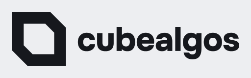
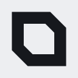
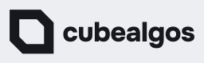
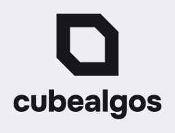
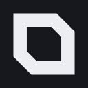
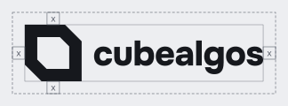
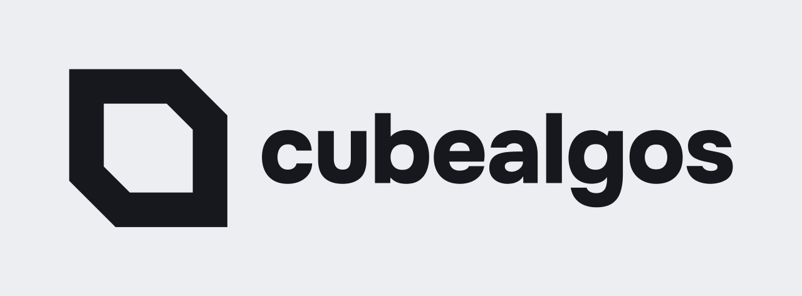

# Cube Algos brand guidelines

How to use the Cube Algos brand: palette, type, logo, the clownfish, motion, voice and licensing.
Everything here is either generated from the files in this repository or links to the page that holds
the detail, so the rules and the files cannot drift apart. The tokens (`tokens/*.json`, built to
`dist/`) are the source of truth for every colour, size and duration; if this page and a token file
ever disagree, the token file wins and this page is the bug.



**Contents:** [Palette](#palette) · [Typography](#typography) · [Shape](#shape-chamfer-and-spacing) ·
[Logo](#logo) · [The fish](#the-fish) · [Motion](#motion) · [Voice and copy](#voice-and-copy-rules) ·
[Licensing](#licensing-of-the-brand) · [Putting it together](#putting-it-together-a-one-page-layout)

## Palette

Eight colours make the brand. Use the token names in code (`dist/css/tokens.css`); the hex values are
for design tools.

| Colour | Hex | Token | Role |
| --- | --- | --- | --- |
| Paper | `#EDEEF1` | `color.primitive.paper` | Light ground; text on ink |
| Ink | `#16181D` | `color.primitive.ink` | Text on paper, the dark ground, text and the logo on amber |
| Muted | `#5A5F6B` | `color.primitive.muted` | Secondary text on paper (5.5:1) |
| Grid | `#CDD0D6` | `color.primitive.grid` | Hairlines and edges on paper; decoration |
| Amber | `#D9831A` | `color.primitive.amber` | Fills, buttons, the mascot, the accent; decoration |
| Signal text | `#9A5A0B` | `color.primitive.signal-text` | Amber as text on paper (4.7:1) |
| Fish band | `#E7CEB0` | `color.primitive.fish-band` | The clownfish band: 70% paper over amber; decoration |
| White | `#FBFBFC` | `color.primitive.on-amber-white` | The light card surface; takes the accent role on amber |

The dark theme needs four more values of its own, because the light ones fail on ink: card `#23262D`,
muted `#9AA0AC`, rule `#2E323B` and accent text `#E8A452`.

### Semantic roles

Use roles, not primitives, in interfaces. The CSS custom properties switch with the visitor's theme
(`prefers-color-scheme`), or with `data-theme="light"` / `data-theme="dark"` on `<html>`.

| Role (CSS property) | Light | Dark | Use |
| --- | --- | --- | --- |
| `bg` (`--color-bg`) | `#EDEEF1` | `#16181D` | Page background |
| `card` (`--color-card`) | `#FBFBFC` | `#23262D` | Cards, panels |
| `fg` (`--color-fg`) | `#16181D` | `#EDEEF1` | Body text |
| `muted` (`--color-muted`) | `#5A5F6B` | `#9AA0AC` | Secondary text |
| `rule` (`--color-rule`) | `#CDD0D6` | `#2E323B` | Hairlines; decoration |
| `accent-fill` (`--color-accent-fill`) | `#D9831A` | `#D9831A` | Fills and decoration |
| `accent-text` (`--color-accent-text`) | `#9A5A0B` | `#E8A452` | Amber-family text |
| `on-accent` (`--color-on-accent`) | `#16181D` | `#16181D` | Text and the mark on an amber fill |
| `focus` (`--color-focus`) | `#9A5A0B` | `#E8A452` | Focus rings (3:1 against bg and card) |

### The two rules

1. **Amber is for fills and decoration only on paper.** It is 2.5:1 on paper, so it is never text and
   never a UI boundary on the light ground. On ink it is 6.1:1. Amber-family text uses `accent-text`.
2. **On amber, white takes the accent role and the mark is ink.** Text and the logo on an amber fill
   are ink (6.1:1). White (`#FBFBFC`) on amber is 2.8:1, so it is decoration only (the amber sting's
   echo, the fish body), never text.

### Contrast

Text needs 4.5:1; large text (at least 24 px, or 18.66 px bold) and UI boundaries need 3:1;
decoration has no threshold and is listed so the exemption stays visible. This is the table from
[`contrast.md`](contrast.md), which `npm run check:contrast` regenerates; `npm run check:docs` fails
if this copy is stale.

| Pair (fg/bg) | Theme | Kind | Foreground | Background | Ratio | Required | Result |
| --- | --- | --- | --- | --- | --- | --- | --- |
| `fg/bg` | light | text | `#16181D` | `#EDEEF1` | 15.31:1 | 4.5:1 | pass |
| `fg/bg` | dark | text | `#EDEEF1` | `#16181D` | 15.31:1 | 4.5:1 | pass |
| `fg/card` | light | text | `#16181D` | `#FBFBFC` | 17.17:1 | 4.5:1 | pass |
| `fg/card` | dark | text | `#EDEEF1` | `#23262D` | 13.05:1 | 4.5:1 | pass |
| `muted/bg` | light | text | `#5A5F6B` | `#EDEEF1` | 5.51:1 | 4.5:1 | pass |
| `muted/bg` | dark | text | `#9AA0AC` | `#16181D` | 6.76:1 | 4.5:1 | pass |
| `muted/card` | light | text | `#5A5F6B` | `#FBFBFC` | 6.18:1 | 4.5:1 | pass |
| `muted/card` | dark | text | `#9AA0AC` | `#23262D` | 5.77:1 | 4.5:1 | pass |
| `accent-text/bg` | light | text | `#9A5A0B` | `#EDEEF1` | 4.71:1 | 4.5:1 | pass |
| `accent-text/bg` | dark | text | `#E8A452` | `#16181D` | 8.34:1 | 4.5:1 | pass |
| `accent-text/card` | light | text | `#9A5A0B` | `#FBFBFC` | 5.29:1 | 4.5:1 | pass |
| `accent-text/card` | dark | text | `#E8A452` | `#23262D` | 7.11:1 | 4.5:1 | pass |
| `on-accent/accent-fill` | light | text | `#16181D` | `#D9831A` | 6.10:1 | 4.5:1 | pass |
| `on-accent/accent-fill` | dark | text | `#16181D` | `#D9831A` | 6.10:1 | 4.5:1 | pass |
| `fg/accent-fill` | light | text | `#16181D` | `#D9831A` | 6.10:1 | 4.5:1 | pass |
| `fg/accent-fill` | dark | decoration | `#EDEEF1` | `#D9831A` | 2.51:1 | n/a | exempt |
| `focus/bg` | light | boundary | `#9A5A0B` | `#EDEEF1` | 4.71:1 | 3:1 | pass |
| `focus/bg` | dark | boundary | `#E8A452` | `#16181D` | 8.34:1 | 3:1 | pass |
| `focus/card` | light | boundary | `#9A5A0B` | `#FBFBFC` | 5.29:1 | 3:1 | pass |
| `focus/card` | dark | boundary | `#E8A452` | `#23262D` | 7.11:1 | 3:1 | pass |
| `rule/bg` | light | decoration | `#CDD0D6` | `#EDEEF1` | 1.33:1 | n/a | exempt |
| `rule/bg` | dark | decoration | `#2E323B` | `#16181D` | 1.38:1 | n/a | exempt |
| `accent-fill/bg` | light | decoration | `#D9831A` | `#EDEEF1` | 2.51:1 | n/a | exempt |
| `accent-fill/bg` | dark | decoration | `#D9831A` | `#16181D` | 6.10:1 | n/a | exempt |
| `accent-on-amber/accent-fill` | light | decoration | `#FBFBFC` | `#D9831A` | 2.82:1 | n/a | exempt |
| `accent-on-amber/accent-fill` | dark | decoration | `#FBFBFC` | `#D9831A` | 2.82:1 | n/a | exempt |

## Typography

| Use | Font | Weight |
| --- | --- | --- |
| Display and headings | **Onest** | 800 |
| Body text | **Onest** | 400 |
| Labels and code | **DM Mono** | 400 |

Both are licensed under the SIL Open Font License 1.1 with no Reserved Font Name, so they may be
subset, self-hosted and used commercially without conditions (the OFL text for Onest is in
[`assets/fonts/OFL.txt`](../assets/fonts/OFL.txt)). Self-host the fonts rather than loading them from
a third party. Fallbacks: `--font-family-sans` is Onest, `system-ui`, `sans-serif`;
`--font-family-mono` is DM Mono, `ui-monospace`, `monospace`.

| Step | Size | Line height | Tracking | Font |
| --- | --- | --- | --- | --- |
| display | 3.5rem | 1.05 | -0.02em | Onest 800 |
| h1 | 2.5rem | 1.1 | -0.015em | Onest 800 |
| h2 | 1.875rem | 1.2 | -0.01em | Onest 800 |
| h3 | 1.375rem | 1.3 | -0.005em | Onest 800 |
| body | 1rem | 1.6 | 0 | Onest 400 |
| small | 0.875rem | 1.5 | 0 | Onest 400 |
| label | 0.75rem | 1.2 | 0.08em | DM Mono 400 |

**German glyphs:** both families render Ä Ö Ü ä ö ü ß correctly. Check a German headline with all
three umlauts and ß in any new layout, and set German text with `lang="de"` so hyphenation and
quotes follow the language.

## Shape: chamfer and spacing

Corners are cut, not rounded. The top-right and bottom-left corners are cut (as in the mark); the other
two stay square. Sizes: `--chamfer-sm` 6 px (tags, inline controls), `--chamfer-md` 9 px (buttons,
inputs), `--chamfer-lg` 16 px (cards, panels). The `clip-path` pattern, and a focus ring that survives
the clipping, are in the README's [Chamfer section](../README.md#chamfer). Spacing is a 4 px base:
steps 1, 2, 3, 4, 6, 8, 12, 16, 24 are 4, 8, 12, 16, 24, 32, 48, 64 and 96 px. Radii exist only as
`none` (0), `sm` (2 px) and `full` (pills, avatars); prefer the chamfer.

## Logo

The logo is the chamfer ring (a square ring cut at the top right and bottom left) and the lowercase
wordmark `cubealgos`, one word, in Onest 800 converted to outlines. In running text the company is
still written "Cube Algos". Full detail, files and the clear-space diagram: [`logo.md`](logo.md).

| Lockup | Use | Preview |
| --- | --- | --- |
| Mark | Small spaces, avatars, app icons |  |
| Horizontal lockup | Default: mark left, wordmark right |  |
| Stacked lockup | Square and narrow spaces: mark above wordmark |  |
| Wordmark | Only where the mark already appears nearby | `assets/logo/wordmark.svg` |

**Colourways: one colour per use, never amber.**

| Ground | Logo colour | File suffix |
| --- | --- | --- |
| Paper `#EDEEF1` | ink | `ink-on-paper` |
| Amber `#D9831A` | ink | `ink-on-amber` |
| Ink `#16181D` | paper | `paper-on-ink` |
| Transparent, you choose the ground | `ink` or `paper` | `ink`, `paper` |




**Clear space:** `x` on all sides, where `x` is one ring wall (14/64 of the mark's side). Nothing
enters that box.



**Minimum size:** mark 16 px, wordmark lockup 96 px wide (print: lockup 20 mm wide). Below 16 px use
the favicon set in `assets/favicon/`.

**Misuse.** Do not recolour the logo, use amber for it in any form, stretch, squash, rotate or skew it,
outline it or add strokes, shadows, glows, gradients or other effects, place it on a busy background
or photograph without a solid ground, or redraw it, re-set the wordmark in a font or change the
chamfers.

## The fish

The secondary character is a chubby clownfish with a forked tail, called "the clownfish" or "the
fish": a generic clownfish, never a specific film character. Detail and files: [`mascot.md`](mascot.md).


**Silhouette rules.**

- One flat silhouette in every pose: a body with all four corners cut (the logo's language), a forked
  triangle tail and one vertical band. The silhouette alone must say "fish" and "cute".
- No outlines and no drawn details. Draw nothing on top of a shape except the eyes: two ink bar eyes by
  default.
- Between poses only the eyes, the posture and small extras outside the shape change (the `?`, the
  `z Z`, a tear).

**Two colour versions only.**

| Version | Body | Band | Eyes | For |
| --- | --- | --- | --- | --- |
| Standard (`assets/fish/`) | amber `#D9831A` | `#E7CEB0` | ink `#16181D` | every background except amber |
| On amber (`assets/fish/on-amber/`) | white `#FBFBFC` | `#E7CEB0` | ink | amber backgrounds |

**Poses and the states they mark.**

| Pose | State | Pose | State |
| --- | --- | --- | --- |
| idle | default | confused | 404 page |
| swimming | loading | sad | errors that are not a 404 |
| happy | sent, saved | asleep | empty states |
| dead | crashes and fatal errors | | |

Static SVGs are in `assets/fish/<pose>.svg`, animated ones in `assets/fish/animated/`, loops for
social media (GIF, WebM) in `assets/fish/animated/social/`.

## Motion

The system is **"Draw, then press"**, one language for interfaces and video:

- Lines draw, shapes fill.
- A press marks completion: scale 1.04 to 1.06 (the token is 1.05), never a bounce.
- Calm in between.
- Amber marks the moment.
- Still is fine: under `prefers-reduced-motion: reduce` nothing animates and the key frame shows.

### Durations

Source: `tokens/motion.json`; for video tools `dist/motion/motion.json` carries the same values.

| Token | ms | Frames at 24 fps | Frames at 60 fps | Use |
| --- | --- | --- | --- | --- |
| instant | 100 | 2 | 6 | Hover colour, focus ring |
| quick | 200 | 5 | 12 | Button press, small toggles |
| base | 300 | 7 | 18 | Cards, panels, menus |
| press | 120 | 3 | 7 | The completion press |
| echo | 700 | 17 | 42 | The amber echo after a meaningful completion |
| draw | 900 | 22 | 54 | Lines and outlines being drawn |
| wipe | 1000 | 24 | 60 | Chamfer wipe: 500 in, 500 out |
| sting | 1800 | 43 | 108 | The full logo sting |

### Easings

| Token | Value | Use |
| --- | --- | --- |
| draw | `cubic-bezier(.65,0,.35,1)` | Things being built: strokes and wipes |
| settle | `cubic-bezier(.2,.8,.3,1)` | Things arriving and settling: card text, the press |
| echo | `cubic-bezier(.1,.6,.3,1)` | The amber echo leaving the mark |
| ease-out | `cubic-bezier(.3,0,.2,1)` | Hover, focus and small UI responses |

None overshoots, so nothing bounces.

### Transitions

- **The chamfer wipe:** an amber panel with the logo's chamfer crosses the frame; scenes switch at its
  centre. 500 ms in and 500 ms out (1000 ms in all).
- **Text rise:** lines rise into place with a small stagger, and an amber underline is drawn left to
  right.

### The logo sting

"Draw + Ping" with a single amber echo, 1800 ms: the outline draws (0 to 900 ms), the shape fills
(850 to 1100 ms), one echo leaves the mark (scale 1 to 1.75, fading) while the mark presses to 1.06,
and the wordmark slides in (1200 to 1500 ms). The GIF loops at 3.2 s. On amber the mark is ink and the
echo is white. Files, frame table and recipe: [`motion.md`](motion.md).



### Video structure

16:9 and 9:16 share one timeline: **sting, wipe, headline, wipe, the fish swims in with a line, wipe,
end card.** Sting videos exist at 16:9, 9:16 and 1:1 in `assets/sting/`.

## Voice and copy rules

- **First person "I".** Kevin is visible as the person behind Cube Algos; the company name stays
  "Cube Algos".
- **German uses the formal "Sie".**
- **Concrete over abstract.** Say what is built, for whom, by when.
- **No claim that cannot be backed.** **No invented numbers.**
- **No response-time promises**, anywhere.
- **Prices are shown net, as "from".**
- **Accessibility wording (German):** say "barrierearm" or "auf Barrierefreiheit ausgelegt", never
  "barrierefrei gebaut", which reads as a legal conformity promise.
- **The German name of the idea check is "Erstgespräch mit Konzept"** (English: "Idea check").
- **Error and empty states:** short, kind, never jokey about a real problem.

### Water and tech double meanings

To honour the fish, the copy uses words that read as both tech and water, **sparingly: at most one per
section, and only where the plain meaning is already the right word.**

- **Use:** flow, workflow, launch, drift (out of date), stream, ship; German Abläufe, im Fluss,
  einfließen, "So läuft es ab", Stapellauf (only if it fits).
- **Avoid:** anything that becomes a pun or a joke; any water idiom that means struggling (afloat, keep
  your head above water, über Wasser halten, ins Schwimmen geraten); water words in error states, except
  the 404's "swam off".

## Licensing of the brand

Two licences, split on purpose:

| What | Licence | Free to use? |
| --- | --- | --- |
| Code: design-token sources, build and generator scripts, CI, docs tooling | Apache-2.0 + CLA ([`LICENSE`](../LICENSE), [`NOTICE`](../NOTICE), [`CLA.md`](../CLA.md)) | Yes, under Apache-2.0 |
| Assets: logos, wordmark, clownfish, favicons, stings, animations | All rights reserved, trademarks ([`assets/LICENSE.md`](../assets/LICENSE.md)) | No |

You may show the logo or wordmark **unmodified** to refer to Cube Algos. Anything else (recolouring,
animating, redrawing, using the mascot, using an asset in your own product or brand, redistributing
the files) needs written permission from hello@cubealgos.de. The fonts are separate and are OFL
(see Typography).

## Putting it together: a one-page layout

1. Copy `tokens.css` from a release (or `dist/css/tokens.css`) and self-host Onest and DM Mono.
2. Set the page on `--color-bg` and `--color-fg` in Onest 400, the headline in Onest 800 at the
   display step, and use the horizontal lockup (ink on paper, or paper on ink in the dark theme) top
   left with clear space `x` around it.
3. Make the main button an amber fill (`--color-accent-fill`) with ink text (`--color-on-accent`) and
   a medium chamfer; give it the focus ring from the README.
4. Put amber text only through `--color-accent-text`, never `--color-accent-fill`.
5. Use the idle fish in the hero and the matching pose for any error or empty state.

```css
@import "tokens.css";
body { background: var(--color-bg); color: var(--color-fg); font-family: var(--font-family-sans); font-weight: 400; }
h1 { font-weight: 800; font-size: 3.5rem; line-height: 1.05; letter-spacing: -0.02em; }
.button {
  --c: var(--chamfer-md);
  background: var(--color-accent-fill); color: var(--color-on-accent);
  clip-path: polygon(0 0, calc(100% - var(--c)) 0, 100% var(--c), 100% 100%, var(--c) 100%, 0 calc(100% - var(--c)));
  transition: background-color var(--duration-instant) var(--ease-out);
}
```
